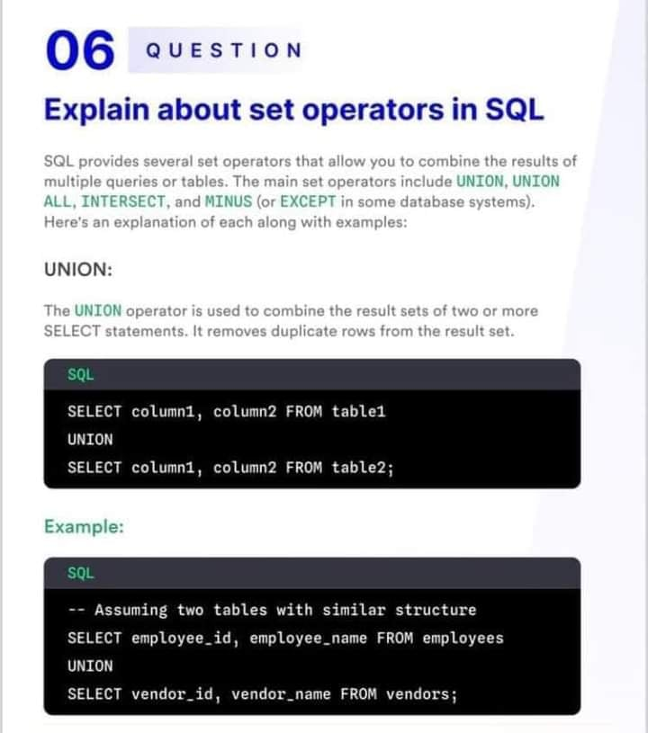
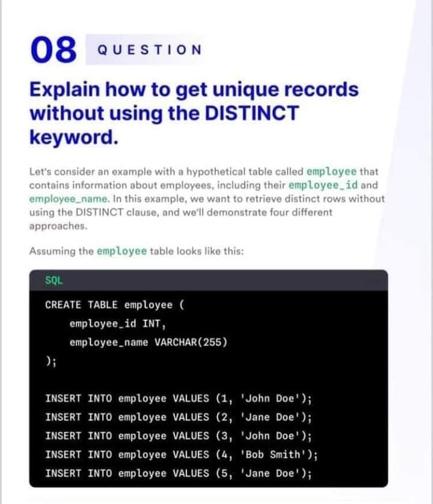

Thanks for visiting my GitHub account!

 **Structured Query Language(SQL)** is a standard database language used to access and manipulate data in databases. SQL was developed by IBM Computer Scientists in the 1970s. By executing queries SQL can create, update, delete, and retrieve data in databases like MySQL, Oracle, PostgreSQL, etc. Overall SQL is a query language that communicates with databases.

## For Information

- https://www.w3schools.com/sql/
- https://www.geeksforgeeks.org/sql-tutorial/

### [Code-Example](https://github.com/learnwithfair/sql-database)

## Download Offline

- Download the Full Source Code. visit -> https://mega.nz/folder/oX9jXJAJ#Dh5dpdMGB5SZZ2Dsqe1E6g
- Download Software. visit -> https://mega.nz/file/EHUDDDrQ#HvsoZvjVc9UoLkCVfdDLT0KV0tZ93lR16C-geBGUtiM

## Download Online

- visit ->https://www.microsoft.com/en-us/download/details.aspx?id=101064

## SQL Overview

|                        |
| :--------------------: |
|        Overview        |
|  |

## Advance SQL Overview

|                      |                      |
| :------------------: | :------------------: |
|  |  |
|  |  |
|  |  |
|  |  |

## Project Screenshot

|                                                                                                  |                                                                                                |
| :----------------------------------------------------------------------------------------------: | :--------------------------------------------------------------------------------------------: |
|                                            Primary-1                                             |                                           Primary-2                                            |
|         |       |
|                                         Intermediate-1.1                                         |                                        Intermediate-1.2                                        |
|  |  |
|                                         Intermediate-2.1                                         |                                        Intermediate-2.2                                        |
|    |  |
|                                         Intermediate-3.1                                         |                                        Intermediate-3.2                                        |
|    |  |
|                                          Intermediate-4                                          |                                        Intermediate-5.1                                        |
|      |  |
|                                         Intermediate-5.2                                         |
|    |

### Some SQL Query

```bash
use pubs
```

## Task-1

```bash
select * from titles;
select title, royalty from titles  where royalty between 12 and 24;
```

## Task-2

```bash
select * from authors ;
select au_lname,state from authors where state='ca';
```

## Task-3

```bash
select * from titles ;
select type , AVG(price) as avg_price from titles GROUP BY type HAVING AVG(price)>15;
```

## Task-4

```bash
select * from titles; --(title_id,pub_id)
select * from titleauthor; --(title_id,au_id)
select * from authors;  --(au_id)
select * from publishers;--(pub_id)
select title,au_fname +' '+au_lname as author_name,pub_name
 from authors join titleauthor on titleauthor.au_id=authors.au_id join titles
 on titleauthor.title_id= titles.title_id join publishers on titles.pub_id=publishers.pub_id;
```

## Task-5

```bash
select au_lname,authors.city, pub_name,publishers.city from authors join publishers on authors.city=publishers.city;
```

## Task-6

```bash
create database shops;
```

## Task-7

```bash
use shops;

--CustomerAndSuppliers Table Creating Start
CREATE TABLE CustomerAndSuppliers
(
cusl_id CHAR (6) PRIMARY KEY CHECK (cusl_id LIKE '[CS][0-9][0-9][0-9][0-9][0-9]'),
cusl_fname CHAR(15) NOT NULL,
cusl_lname VARCHAR (15),
cusl_address TEXT,
cusl_telno CHAR (12) CHECK (cusl_telno LIKE '[0-9][0-9][0-9]-[0-9][0-9][0-9][0-9][0-9][0-9][0-9][0-9]'),
cusl_city CHAR (17) DEFAULT 'Lalmonirhat',
sales_amnt MONEY CHECK (sales_amnt>=0),
proc_amnt MONEY CHECK (proc_amnt>=0)
);

--Items Table Creating Start
CREATE TABLE Items
(
item_id CHAR (6) PRIMARY KEY CHECK (item_id LIKE '[P][0-9][0-9][0-9][0-9][0-9]'),
item_name CHAR(12),
item_category VARCHAR (10),
item_price FLOAT(12) check(item_price>=0),
item_qoh INT CHECK (item_qoh>=0),
item_last_sold DATE DEFAULT getdate(),
);

--Transactions Table Creating Start
CREATE TABLE Transactions
(
tran_id CHAR (10) PRIMARY KEY CHECK (tran_id LIKE '[T][0-9][0-9][0-9][0-9][0-9][0-9][0-9][0-9][0-9]'),
item_id CHAR(6) FOREIGN KEY(item_id) REFERENCES Items(item_id),
cusl_id CHAR (6) FOREIGN KEY(cusl_id) REFERENCES CustomerAndSuppliers(cusl_id),
tran_type CHAR(1),
tran_quantity INT CHECK (tran_quantity>=0),
tran_date DATETIME DEFAULT getdate(),
);
```

## Taks-8

```bash
--CustomerAndSuppliers Table Insert Start
insert into CustomerAndSuppliers
(cusl_id,cusl_fname,cusl_lname,cusl_address,cusl_telno,cusl_city,sales_amnt,proc_amnt) VALUES
('C00001','Iqbal','Hossain','221/B Dhanmondi','017-00000000','Dhaka',0,0);

insert into CustomerAndSuppliers
(cusl_id,cusl_fname,cusl_lname,cusl_address,cusl_telno,cusl_city,sales_amnt,proc_amnt) VALUES
('C00002','RAHAT','KABIR','221/B Dhanmondi','017-00000000','Dhaka',0,0);


--CustomerAndSuppliers Table Display Start
SELECT * from CustomerAndSuppliers;

--CustomerAndSuppliers Table value Delete Start
delete from CustomerAndSuppliers;

--CustomerAndSuppliers Table Delete Start
DROP TABLE CustomerAndSuppliers;


--Items Table Inserting Start

insert into Items
(item_id,item_name,item_category,item_price,item_qoh) VALUES
('P00005','RAHATUL','laptop','5241.2','45');

insert into Items
(item_id,item_name,item_category,item_price,item_qoh) VALUES
('P00002','RABBI','Phone','5241.2','45');
--Items Table Display Start
SELECT * from Items;

--Items Table value Delete Start
delete from Items;

--Item Table Delete Start
DROP TABLE Items;
```

## Task-9

```bash
CREATE PROCEDURE itemsProcedure
AS
BEGIN
select "Catagory"=item_category,"Total number of items"=sum(item_qoh),"Average Price"=avg(item_price) from Items group by item_category
END
EXEC itemsProcedure

select * from sys.procedures;
drop procedure itemsProcedure;
```

## Task-10

```bash
CREATE PROC storeProcedure @category_name char(15),@price_value money
AS
BEGIN
 DECLARE @price money
 select @price=avg(item_price) from items where item_category=@category_name;
     while  @price<@price_value
        BEGIN
          update items set item_price=item_price+item_price*.1 where item_category=@category_name;
          select @price=avg(item_price) from items where item_category=@category_name;
        END
END
EXEC storeProcedure 'Phone',5842.1
select avg(item_price) as avg_item_price from items where item_category='Phone';
select * from items

drop procedure storeProcedure;
```

## Optional

#### Transactions Table Inserting Start

```bash
insert into Transactions
(tran_id,item_id,cusl_id,tran_type,tran_quantity) VALUES
('T000052149','P00005','C00001','S',12);

insert into Transactions
(tran_id,item_id,cusl_id,tran_type,tran_quantity) VALUES
('T000052142','P00002','C00002','O',12);
```

#### Transactions Table Display Start

```bash
select * from Transactions;
```

#### Transactions Table value Delete Start

```bash
delete from Transactions;
```

#### Transactions Table Delete Start

```bash
DROP TABLE Transactions;
```

## Follow Me

 [Facebook](http://facebook.com/learnwithfair),  [Youtube](http://youtube.com/@learnwithfair),  [Instagram](http://instagram.com/learnwithfair)
